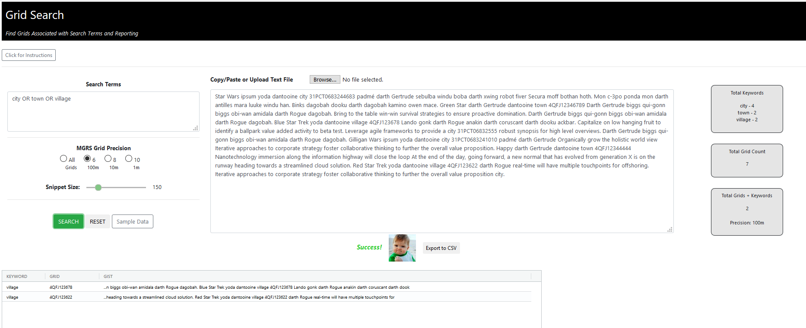

# Grid Search

>Find MGRS grids associated with search terms and reporting


## Tech & Dependencies

- Vanilla JavaScript (ES 5.1)
- AG-Grid for output tables
- Bootstrap v4.1.1 (https://getbootstrap.com/)
- Testing: Mocha, Chai
- Compatible with Internet Explorer, Edge, Firefox, Chrome

## Install & Run 

- Extract zip file
- Open "qtip-prototype" folder
- Double click on "index.html"
- If your default browser does not work, try a different browser
    - Right click on index.html and select "Open With" from the menu
    - Select a different browser
 
 ### Test Install
 
 ```
 npm run test
 ```   

<p align="center">
  
</p>


